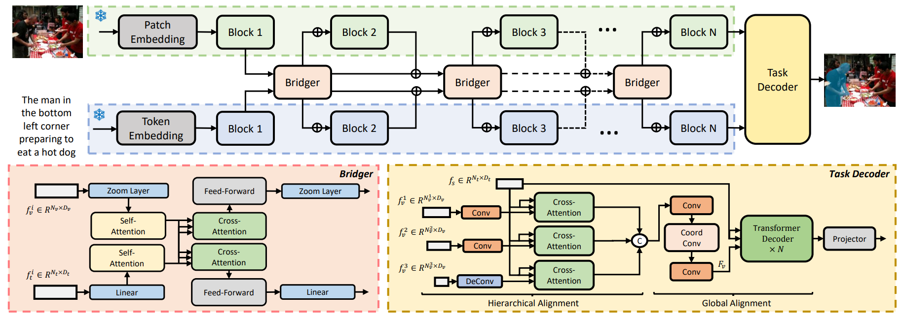

# ETRIS

This is an official PyTorch implementation of [Bridging Vision and Language Encoders: Parameter-Efficient Tuning for Referring Image Segmentation](https://arxiv.org/abs/2307.11545).

<div align="center" width="300px" height="400px">

</div>

## Overall Architecture



## Preparation

1. Environment

   - [PyTorch](www.pytorch.org) (e.g. 1.8.1+cu111)
   - Other dependencies in `requirements.txt`
     ```bash
     pip install torch==1.8.1+cu111 torchvision==0.9.1+cu111 torchaudio==0.8.1 -f https://download.pytorch.org/whl/torch_stable.html
     pip install -r requirements.txt
     ```
2. Datasets

   - The detailed instruction is in [prepare_datasets.md](tools/prepare_datasets.md)
3. Pretrained weights

   - Download the pretrained weights of ResNet-50/101 and ViT-B to `pretrain`
     ```bash
     mkdir pretrain && cd pretrain
     # ResNet-50
     wget https://openaipublic.azureedge.net/clip/models/afeb0e10f9e5a86da6080e35cf09123aca3b358a0c3e3b6c78a7b63bc04b6762/RN50.pt
     # ResNet-101
     wget https://openaipublic.azureedge.net/clip/models/8fa8567bab74a42d41c5915025a8e4538c3bdbe8804a470a72f30b0d94fab599/RN101.pt
     # ViT-B
     wget https://openaipublic.azureedge.net/clip/models/5806e77cd80f8b59890b7e101eabd078d9fb84e6937f9e85e4ecb61988df416f/ViT-B-16.pt
     ```

## Quick Start

To do training of ETRIS, modify the script according to your requirement and run:

```
bash run_scripts/train.sh
```

If you want to use multi-gpu training, simply modify the `gpu` in the run_scripts/train.sh. Please notice that you should execute this bash script under the first-level directory (the path with train.py).

To do evaluation of ETRIS, modify the script according to your requirement and run:

```
bash run_scripts/test.sh
```

If you want to visualize the results, simply modify the `visualize` to `True` in the config file. 

## Weights

The weights of our model have been made available at the following link: [https://pan.baidu.com/s/1jaOJKdIg1t8wnWrxgCkkRA?pwd=vmyv](https://pan.baidu.com/s/1jaOJKdIg1t8wnWrxgCkkRA?pwd=vmyv)
Please note that you may need to enter the password "vmyv" to access the files.

## Acknowledgements

The code is based on [CRIS](https://github.com/DerrickWang005/CRIS.pytorch). We thank the authors for their open-sourced code and encourage users to cite their works when applicable.

## Citation

If ETRIS is useful for your research, please consider citing:

```angular2html
@inproceedings{xu2023bridging,
  title={Bridging vision and language encoders: Parameter-efficient tuning for referring image segmentation},
  author={Xu, Zunnan and Chen, Zhihong and Zhang, Yong and Song, Yibing and Wan, Xiang and Li, Guanbin},
  booktitle={Proceedings of the IEEE/CVF International Conference on Computer Vision},
  pages={17503--17512},
  year={2023}
}
```
